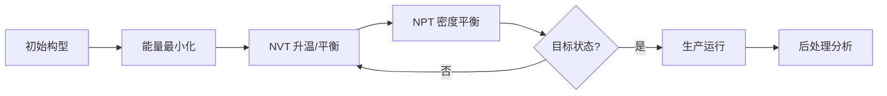

在运行 `lmp -in script.lammps` 之前，真正的研究工作其实已经完成了 70%。LAMMPS 只是一个“执行器”，它不会帮你验证物理模型的合理性。

从一个**完整、严谨的微观研究**角度来看，在编写 LAMMPS 输入脚本之前，你必须完成以下 **5 个核心阶段**的准备：

### 1. 科学问题定义与文献调研 (The "Why")
不要为了模拟而模拟。在打开编辑器前，你需要明确：
-   **核心假设：** 你想验证什么？（例如：“晶界处的偏析导致了材料脆化”）
-   **观测量：** 你需要从轨迹中提取什么物理量来证明假设？（应力应变曲线？径向分布函数？扩散系数？）
-   **对标实验/理论：** 是否有实验数据或 DFT 计算结果作为基准？**没有验证的 MD 只是彩色动画。**
-   **尺度评估：** 你的问题是否真的需要 MD？时间尺度（ns-μs）和空间尺度（nm-μm）是否在 MD 能力范围内？是否需要改用 CGMD、DD 或 FEM？

### 2. 力场选择与验证 (The "Physics")
这是 MD 模拟中**最致命**的一步。垃圾进，垃圾出。
-   **力场匹配性：** 确认所选势函数是否适用于你的体系、温度范围和压力条件。
    -   *金属/合金:* EAM, MEAM, ADP
    -   *共价键材料:* Tersoff, REBO, AIREBO
    -   *有机/生物:* OPLS-AA, CHARMM, AMBER, COMPASS
    -   *离子液体/熔盐:* CLAYFF, Born-Mayer-Huggins
-   **文献溯源：** 找到该势函数的**原始论文**。检查作者当初是用什么性质拟合的？（如果势函数是用晶格常数拟合的，用它算熔化点可能完全错误）。
-   **预验证测试：** 在正式跑大体系前，先用小盒子测试：
    -   晶格常数、弹性模量是否与实验/DFT一致？
    -   熔点、热膨胀系数是否在合理范围？
    -   高温下是否出现非物理的结构崩塌？

### 3. 初始构型构建 (The "Geometry")
LAMMPS 的 `read_data` 读入的文件必须物理合理。
-   **结构来源：**
    -   晶体：用 Atomsk, Ovito, ASE 等工具生成完美晶格，避免手动写坐标出错。
    -   非晶/液体：Packmol, Moltemplate, Topotools 填充。
    -   复杂界面/缺陷：使用专门的建模工具（如 Grain Boundary Generator, Dislocation Builder）。
-   **几何检查：**
    -   **原子重叠：** 检查最近邻距离，避免初始能量爆炸。
    -   **化学计量比：** 确认原子数目比例正确。
    -   **边界条件：** 周期性边界是否合理？表面模型是否有足够的真空层？
-   **格式转换：** 将 PDB/CIF/XYZ 等格式转换为 LAMMPS data 文件时，务必检查 **atom style**、**charge**、**type mapping** 是否正确映射。

### 4. 模拟方案设计 (The "Protocol")
在写脚本之前，先在纸上或笔记本中画出完整的模拟流程图：

你需要提前确定：
-   **系综选择：** NVE/NVT/NPT/NPH？为什么选这个？
-   **温控/压控算法：** Nose-Hoover vs Berendsen vs Langevin？弛豫时间参数 (`Tdamp`, `Pdamp`) 如何设定？（通常 Tdamp ≈ 100×dt, Pdamp ≈ 1000×dt）
-   **时间步长：** 基于最高振动频率估算。一般全原子 1fs，含氢约束 2fs，粗粒化 10-20fs。**必须做能量守恒测试来确定最大稳定步长。**
-   **平衡判据：** 怎么判断系统平衡了？（温度波动<1%？势能平台？MSD线性区？）计划平衡多久？
-   **采样策略：** 输出频率是多少？是否会撑爆硬盘？统计误差如何估计？

### 5. 技术环境与资源规划 (The "Engineering")
-   **编译优化：** 确认 LAMMPS 编译时开启了必要的包（`USER-REAXC`, `GPU`, `INTEL`, `KOKKOS` 等）。未优化的版本可能慢 10-100 倍。
-   **并行效率测试：** 在你的计算平台上做弱/强缩放测试，找到最佳核数。超过某个核数后通信开销会导致效率下降。
-   **存储预算：** 估算轨迹文件大小。`dump` 频率 × 原子数 × 帧数 = ? 是否需要压缩输出或使用二进制格式？
-   **可复现性准备：** 建立项目文件夹结构，记录随机种子、软件版本、编译选项。**六个月后的你一定会感谢现在的你。**

---

### ✅ 输入前的最终检查清单

| 检查项 | 状态 |
| :--- | :--- |
| 科学问题明确，有明确的验证目标 | ☐ |
| 势函数已查阅原文并做过基准测试 | ☐ |
| 初始构型无重叠、化学计量正确 | ☐ |
| 模拟流程（min→eq→prod）已书面设计 | ☐ |
| 时间步长经过能量守恒验证 | ☐ |
| 温控/压控参数有物理依据 | ☐ |
| 输出频率与存储空间匹配 | ☐ |
| LAMMPS 版本与编译选项已记录 | ☐ |
| 已有初步的后处理分析脚本/方案 | ☐ |

> **💡 核心建议：** 把 LAMMPS 输入脚本当作**论文的补充材料**来写。每一行关键命令都应该能在论文方法部分找到对应的物理解释。如果你无法解释为什么要用某个 fix 或某个参数值，那就先停下来去查文献，而不是试错。

完成以上所有步骤后，你写出的 LAMMPS 脚本才是一个**科学研究工具**，而不仅仅是一堆能跑通的代码。